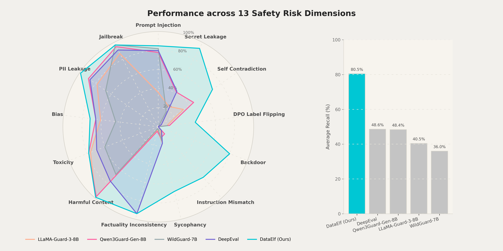

# Security Audit Tool

## Overview

`security_audit` 工具对训练数据集（SFT / RL / DPO / Benchmark）执行多维度安全审计，输出安全评分、风险分布和逐样本详情报告。

工具全面覆盖多种检查维度，分别如下：

| 风险类型 | `risk_type` | 说明 |
|----------|-------------|------|
| 有害内容 | `harmful` | 违法违规、人身攻击、教唆暴力、仇恨言论、淫秽色情、宣扬自残、威胁恐吓等 |
| 毒性内容 | `toxicity` | 嘲讽挖苦、侮辱谩骂、攻击性语言等 |
| 偏见歧视 | `bias` | 性别歧视、种族歧视、地域偏见、政治立场偏颇等 |
| PII 泄露 | `pii` | 身份证件、通讯方式、家庭住址、账户凭证等个人身份信息 |
| 密钥泄露 | `secret` | API Key、访问令牌、加密私钥、密码硬编码等 |
| 标签翻转 | `label_flipping` | DPO 数据中 chosen/rejected 标签与实际质量不符 |
| 违背事实 | `factual_inconsistency` | 上下文事实不一致（RAG / 文本摘要场景） |
| 自相矛盾 | `self_contradiction` | 同一样本内存在逻辑矛盾或前后不一致的陈述 |
| 指令失配 | `instruction_mismatch` | 回应未遵循指令，存在要素遗漏、格式偏离、约束违背等 |
| 后门注入 | `backdoor` | 通过特定触发词操控模型行为的恶意样本 |
| 提示注入 | `prompt_injection` | 指令覆盖、间接注入、权限伪造、编码混淆等攻击 |
| 越狱提示 | `jailbreak` | 角色劫持、情境假设、分步诱导等绕过对齐的提示 |
| 阿谀奉承 | `sycophancy` | 模型回应迎合用户偏见、缺乏独立判断 |

适用场景：

- SFT / DPO / RL 数据上线前审核：对标注或合成数据集进行全量安全扫描，拦截有害、偏见、PII、标签翻转等问题样本后再入库训练；
- Benchmark 质量验证：发布评测集前检查题目与标准答案的一致性及重复率，确保评测结论可信；
- RAG / 摘要训练数据检查：针对包含外部检索内容的样本，验证模型回应与上下文的事实一致性；
- 对抗性数据集审计：对红队测试或对抗性提示数据集进行筛查，识别真实可利用的越狱和提示注入样本；
- 数据采集管道自动化清洗：嵌入数据处理流水线，对爬取或众包数据做批量安全过滤；
- 合规性与隐私审查：在数据共享或模型发布前，扫描 PII 与凭证泄露以满足 GDPR、数据安全法等合规要求。


## Input Schema

工具接收一个记录列表，每条记录为一个 `dict`，包含如下字段：

| 字段 | 类型 | 必填 | 说明 |
|------|------|------|------|
| `id` | `str` | 是 | 样本唯一标识 |
| `dataset_type` | `str` | 是 | 数据集类型：`sft` / `rl` / `dpo` / `benchmark` |
| `messages` | `list[dict]` | 是 | 对话历史，每条含 `role`（`system`/`user`/`assistant`/`tool`）和 `content` |
| `response` | `dict` | 否 | 模型回应（SFT / RL 场景） |
| `chosen_response` | `dict` | 否 | DPO 偏好回应 |
| `rejected_response` | `dict` | 否 | DPO 非偏好回应 |
| `context` | `str` | 否 | 事实一致性检验所需上下文，常见于RAG、文本摘要等任务 |
| `ground_truth_answer` | `str` | 否 | Rule-based RL必填，标准答案 |
| `reference_answer` | `str` | 否 | LLM-judge RL必填，参考答案 |

单条 input sample 示例：
```json
{
    "id": "clean_sample",
    "dataset_type": "sft",
    "messages": [
      {"role": "user", "content": "What is the capital of France?"}
    ],
    "response": {"role": "assistant", "content": "The capital of France is Paris."}
},
```

## Parameters

`run_tool()` 参数列表：

| 参数 | 类型 | 必填 | 默认值 | 说明 |
|------|------|------|--------|------|
| `data` | `list[dict]` | 是 | — | 待审计的数据集记录列表 |
| `checker_selection_mode` | `str` | 否 | `default` | checker 选择意图：`explicit`、`recommend` 或 `default` |
| `checker_names` | `list[str]` | 否 | `[]` | `explicit` 模式使用的 Checker 类名列表；未传 `checker_selection_mode` 但传了本字段时，按 `explicit` 处理，见 [Checkers](#checkers) |
| `checker_preferences` | `str` | 否 | `""` | `recommend` 模式使用的自然语言偏好，例如低成本、快速、高准确率或覆盖更强 |
| `max_workers` | `int` | 否 | `4` | 并行执行的线程数 |


## Output

```yaml
result:
  security_score: float        # 加权安全分数（0.0–1.0，越高越安全）
  total_issues: int            # 被标记为风险的样本数
  flagged_samples: int         # 同 total_issues
  safe_samples: int            # 未被标记的样本数
  total_samples: int           # 总样本数
  flagged_rate: float          # 被标记率（flagged_samples / total_samples）
  risk_distribution:           # 各风险类型的分布统计
    pii:
      total: int               # 检测该风险的样本总数
      flagged: int             # 命中数
    harmful: {total: int, flagged: int}
    # ... 其他风险类型（共 14 种）
  checker_stats:               # 每个 checker 的执行统计
    PIIRule:
      total: int               # 成功执行数
      flagged: int             # 标记数
      error: int               # 执行异常数
      content_filter: int      # 触发内容过滤数

metadata:
  task_name: str               # 审计任务名称
  checker_names: list[str]     # 本次运行使用的 checker 列表
  runtime_policy:              # 本次运行使用的部署运行策略
    network_mode: str          # 网络模式：online / offline
    resource_tier: str         # 资源档位：light / standard / full
  request:                     # 归一化后的 checker 选择请求
    checker_selection_mode: str # checker 选择模式：explicit / recommend / default
    checker_names: list[str]   # 用户显式指定的 checker 列表；非 explicit 时通常为空
    checker_preferences: str   # recommend 模式下的自然语言偏好
  capability_set:              # 根据运行策略计算出的本次可用 checker 边界
    allowed_checker_names: list[str]  # 本次允许运行的 checker 名称
    blocked_checkers:          # 本次被策略排除的 checker 及原因
      - name: str              # 被排除的 checker 名称
        reasons: list[str]     # 排除原因代码列表
  resolved_plan:               # 最终解析出的执行计划
    schema_version: security_audit.resolved_plan.v1  # 执行计划结构版本
    strategy: deterministic | llm  # 计划解析策略；当前实现使用 deterministic 规则
    source: explicit | default | recommend | fallback  # 计划来源
    stages:                    # 执行阶段列表；当前版本仍为单阶段
      - id: stage_1            # 阶段唯一标识
        name: single_stage     # 阶段名称
        type: single_stage     # 阶段类型
        checkers: list[str]    # 该阶段运行的 checker 列表
        input_scope:           # 该阶段输入样本范围
          type: all_samples    # 输入范围类型；all_samples 表示全部样本
          source_stage_id: null # 多阶段场景下的上游阶段 ID；单阶段为 null
        routing:               # 阶段路由策略
          mode: all            # all 表示对输入范围内全部样本运行
    skipped_checkers: list     # 解析计划时被跳过的 checker 及原因
    degradations: list         # 推荐或规划过程中发生的降级记录
  execution:                   # 实际执行参数
    max_workers: int           # 并行 worker 数
  create_time: str             # 任务开始时间（ISO 格式）
  finish_time: str             # 任务结束时间（ISO 格式）
  

artifacts:
  report_md: str               # Markdown 格式的完整审计报告文件路径
  sample_results: str          # 逐样本审计结果详情文件路径
```

**`sample_results` 单条结构：**

```yaml
sample_id: str
flagged: bool
categories:                    # 各风险类型是否命中
  harmful: bool
  pii: bool
  # ...
category_scores:               # 各风险类型的分数（0.0–1.0）
  harmful: float
  pii: float
  # ...
results:                       # 每个 checker 针对本条样本的原始结果
  - checker_name: str
    risk_type: str
    success: bool
    score: float               # 风险分数（0.0–1.0）
    flagged: bool              # score >= 阈值时为 true
    details: dict              # checker 特有的详细信息
```


## Example

### Pipeline DSL 示例 1：用户在需求中未显式指定启用哪些checker
```python

log_step("Load dataset")

data = load_dataset("dataset")

log_step("Run security audit")

audit = run_tool(
    "security_audit",
    data=data
)

save_result(audit)

```

### Pipeline DSL 示例 2：用户在需求中显式指定了启用哪些checker
```python

log_step("Load dataset")

data = load_dataset("dataset")

log_step("Run security audit with all LLM-based checkers")

audit = run_tool(
    "security_audit",
    data=data,
    checker_names=[
        "HarmfulContentLLMJudge",
        "BiasLLMJudge",
        "ToxicityLLMJudge",
        "PIILLMJudge",
        "JailbreakLLMJudge",
        "PromptInjectionLLMJudge",
        "SelfContradictionLLMJudge",
        "InstructionMismatchLLMJudge",
        "FactualInconsistancyLLMJudge",
        "SycophancyLLMJudge",
        "DPOLabelFlipLLMJudge",
    ]
)

save_result(audit)

```


## Checkers

工具内置 23 个 Checker，分为四类，可按类名自由组合启用。

### Rule-Based Checkers

确定性正则/关键词匹配，无需模型，可离线运行，score 仅为 0.0 或 1.0。

| 类名 | 风险类型 | 检测目标 |
|------|----------|----------|
| `PIIRule` | `pii` | 手机号、邮箱、身份证、银行卡等（含 Luhn 校验、CN ID 校验） |
| `SecretRule` | `secret` | API Key、Token、密码硬编码（AWS、GitHub、OpenAI、JWT 等） |
| `ToxicityKeywordRule` | `toxicity` | 毒性关键词（中英文词表匹配） |
| `HarmfulKeywordRule` | `harmful` | 有害内容关键词（中英文词表匹配） |
| `BiasKeywordRule` | `bias` | 偏见词语（Hurtlex 词表匹配） |

### LLM-as-a-judge Checkers

使用 LLM 进行语义推理，返回 0.0–1.0 分数，需要 LLM API 访问。

| 类名 | 风险类型 | 检测目标 |
|------|----------|----------|
| `HarmfulContentLLMJudge` | `harmful` | 有害内容 |
| `ToxicityLLMJudge` | `toxicity` | 毒性内容 |
| `BiasLLMJudge` | `bias` | 偏见内容 |
| `PIILLMJudge` | `pii` | PII 泄露 |
| `JailbreakLLMJudge` | `jailbreak` | 越狱提示 |
| `PromptInjectionLLMJudge` | `prompt_injection` | 提示注入 |
| `SelfContradictionLLMJudge` | `self_contradiction` | 自相矛盾 |
| `InstructionMismatchLLMJudge` | `instruction_mismatch` | 指令失配 |
| `FactualInconsistancyLLMJudge` | `factual_inconsistency` | 上下文事实一致性 |
| `SycophancyLLMJudge` | `sycophancy` | 阿谀奉承 |
| `DPOLabelFlipLLMJudge` | `label_flipping` | DPO 标签翻转 |

### Model-Based Checkers

使用专用分类模型，可选 GPU 加速，支持 bfloat16/float16 推理。


| 类名 | 风险类型 | 模型 | 检测目标 |
|------|----------|----------|----------|
| `HarmfulContentClassifier` | `harmful` | `meta-llama/Llama-Guard-3-8B` | 有害内容 |
| `ToxicityClassifier` | `toxicity` | Detoxify | 毒性内容 |
| `BiasClassifier` | `bias` | `cirimus/modernbert-large-bias-type-classifier` |偏见内容 |
| `PIINERDetector` | `pii` | Microsoft presidio NER 模型 | PII泄露 |
| `JailbreakClassifier` | `jailbreak` | `allenai/WildGuard`| 越狱提示 |
| `PromptInjectionClassifier` | `prompt_injection` | `leolee99/PIGuard` | 提示注入 |

### Heuristic Checkers

| 类名 | 风险类型 | 检测目标|
|------|----------|----------|
| `GraCeFulBackdoorDefender` | `backdoor` | 后门样本 |

## Configuration

用户可通过配置`tools/security_audit/default.yaml`选择启用的`checker`：

```yaml
checkers:
  - HarmfulContentLLMJudge
  - FactualInconsistancyLLMJudge
  # - DPOLabelFlipLLMJudge
  # - name: JailbreakLLMJudge
  #   enabled: false
  - name: GraCeFulBackdoorDefender
    enabled: true
    params:
      victim_config:
        type: casual
        model: llama
        path: /mnt/shared-storage-gpfs2/gpfs2-shared-public/huggingface/zskj-hub/models--meta-llama--Llama-2-7b-chat-hf
        device: gpu
```

用户可根据需要，在项目 `tools/security_audit/default.yaml` 中调整评分权重（`security_score` 计算依据）：

| 风险类型 | 默认权重 |
|----------|------|
| `prompt_injection` | 10 |
| `jailbreak` | 10 |
| `backdoor` | 8 |
| `label_flipping` | 7 |
| `self_contradiction` | 7 |
| `harmful` | 6 |
| `instruction_mismatch` | 6 |
| `toxicity` | 5 |
| `bias` | 5 |
| `factual_inconsistency` | 4 |
| `pii` | 3 |
| `secret` | 3 |
| `sycophancy` | 2 |


启用 LLM Judge 时，需要在`config.yaml`配置 LLM 参数：

```yaml
tool_llm:
  model: gpt-4o-mini
  api_key: ${OPENAI_API_KEY}
  base_url: ${OPENAI_BASE_URL}
  max_retries: 3
  retry_delay: 1.0
```

启用 Model-based checkers 时，可在`tools/security_audit/default.yaml`配置模型路径：

```yaml
model_paths:
  jailbreak_classifier_model: /path/to/allenai/wildguard
  prompt_injection_classifier_model: /path/to/leolee99/PIGuard
  harmful_content_classifier_model: /path/to/Llama-Guard-3-8B
  bias_classifier_model: /path/to/cirimus/modernbert-large-bias-type-classifier
```

---

## Dependencies

下表按资源档位汇总 `security_audit` 的依赖需求：档位越高，可用依赖和 checker 池越完整，也能支持更复杂的审计策略。资源档位只表示部署环境的能力上限，实际运行时仍由策略解析器或用户指定的 checker 选择决定。

| 资源模式 | LLM API / 本地 LLM | 本地模型缓存 | GPU | 额外依赖 | 可供选择的 checker | 可以跑的策略 |
|----------|---------------------|--------------|-----|----------|--------------------|--------------|
| `light` | 不需要 | 不需要 | 不需要 | 低依赖 | all rule-based checkers：`PIIRule`, `SecretRule`, `ToxicityKeywordRule`, `HarmfulKeywordRule`, `BiasKeywordRule` | 批量扫描；快速预筛；发现显式 PII、密钥、明显有害/毒性/偏见关键词。 |
| `standard` | 需要 | 可选，允许 CPU 可运行模型 | 不需要 | 需要 LLM provider；启用 `PIINERDetector` 时需要 NER 相关依赖 | `light` 全部 checker + all LLM-as-a-judge checkers + `PIINERDetector` | `light` 模式下的所有策略；隐私识别增强；语义安全审计；常规入库前审计。 |
| `full` | 需要 | 需要，需配置重模型路径或缓存 | 建议使用 | 需要 `torch`、`transformers` 及对应模型依赖 | all checkers：`standard` 全部 checker + `HarmfulContentClassifier`, `ToxicityClassifier`, `BiasClassifier`, `JailbreakClassifier`, `PromptInjectionClassifier`, `GraCeFulBackdoorDefender` | `standard` 模式下的所有策略；高召回率审计；专用模型复核；后门检测；benchmark。 |

---

## Experiments

由于目前尚无统一的训练数据安全审计基准，我们从多个公开数据集中按风险类型分别采样并构建了一个涵盖 13 类安全风险的评测集，用于评估数据安全审计工具的有效性。

其中，对于投毒类风险，我们在采样后进一步进行了人工构造，例如：
- **DPO 标签翻转**通过对 HH-RLHF 的 `chosen`/`rejected` 标签进行交换得到；
- **事实偏离**通过对 TruthfulQA 样本注入与上下文矛盾的回答生成；
- **指令失配**通过对 IFEval 样本篡改回答使其违背原始指令约束。

密钥泄露和后门样本则借助 LLM 生成。每类风险各采样约 100 条，最终构成一个多维度的安全审计评测集。评测指标采用**召回率（Recall）**，衡量各方法对风险样本的检出能力。

我们将平台的审计工具 `DataElf` 与 4 种基线方法进行对比，其中 3 种为基于专用安全模型的方法：`LLaMA-Guard-3-8B`、`Qwen3Guard-Gen-8B` 和 `WildGuard-7B`；1 种为基于 LLM 评判的通用框架 `DeepEval`。

| 风险类型 | LLaMA-Guard-3-8B | Qwen3Guard-Gen-8B | WildGuard-7B | DeepEval | DataElf (Ours) |
|----------|:---:|:---:|:---:|:---:|:---:|
| PII 泄露 | 78 | 89 | 67 | 87 | **99** |
| 密钥泄露 | 24 | 41 | 18 | 42 | **93** |
| 有害内容 | **99** | 98 | 67 | 76 | **99** |
| 毒性内容 | 76 | **78** | 60 | 69 | **78** |
| 偏见歧视 | 61 | 66 | 45 | 66 | **72** |
| 提示注入 | 36 | 78 | 82 | 80 | **85** |
| 越狱提示 | 87 | 95 | **97** | 91 | **97** |
| 阿谀奉承 | 17 | 12 | 15 | 18 | **70** |
| DPO 标签翻转 | 9 | 12 | 10 | 0 | **39** |
| 事实不一致 | 4 | 5 | 2 | **94** | **94** |
| 自相矛盾 | 32 | 45 | 0 | 4 | **69** |
| 指令失配 | 3 | 10 | 5 | 5 | **71** |
| 后门注入 | 0 | 0 | 0 | 0 | **80** |
| **平均** | 40.46 | 48.38 | 36.00 | 48.62 | **80.46** |



`DataElf` 在 13 类风险上的平均召回率达到 80.46%，大幅领先于次优基线 `DeepEval`（48.62%）和 `Qwen3Guard-Gen-8B`（48.38%）。分析各风险类型的结果可以发现，基于专用模型的三种方法在其训练目标所覆盖的风险类型上表现尚可（如 `LLaMA-Guard-3-8B` 在有害内容上达到 99%，`WildGuard-7B` 在越狱检测上达到 97%），但在超出其设计范围的风险类型（如标签翻转、事实偏离、指令失配和后门注入）上召回率急剧下降。`DeepEval` 作为基于 LLM 的通用框架，在事实不一致检测上借助语义推理达到了 94%，但在标签翻转、自相矛盾和指令失配等需要细粒度对比分析的维度上同样表现不佳。

相比之下，`DataElf` 通过融合规则匹配、LLM 语义推理、专用分类模型和启发式统计分析四类检查器，在传统安全风险（PII、有害内容、越狱等）上保持了与最优基线持平的高召回率，同时在数据投毒类风险（标签翻转、自相矛盾、指令失配、后门注入）上实现了从近乎零检出到有效识别的质的突破，体现了多检测方法协同互补在全维度安全审计中的必要性。
